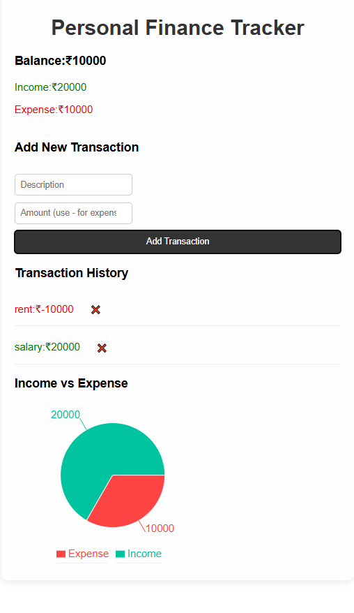

# 💰 Personal Finance Tracker

A simple and responsive web app built with **React.js** that allows users to track their income and expenses, view their current balance, and visualize financial trends using charts. Data is saved using `localStorage` for persistence.

---

## 🚀 Features

- ✅ Add income or expense transactions
- ✅ Delete individual transactions
- ✅ View total balance, income, and expenses
- ✅ Visualize spending with a pie chart (Recharts)
- ✅ Data persists across refresh using `localStorage`

---

## 🛠️ Built With

- React.js (Vite)
- Recharts (for chart visualization)
- CSS (custom styles)

---

## 📷 Preview

 

---

## 📦 Installation

```bash
git clone https://github.com/Pradeep0232/personal-finance-tracker.git
cd personal-finance-tracker
npm install
npm run dev
